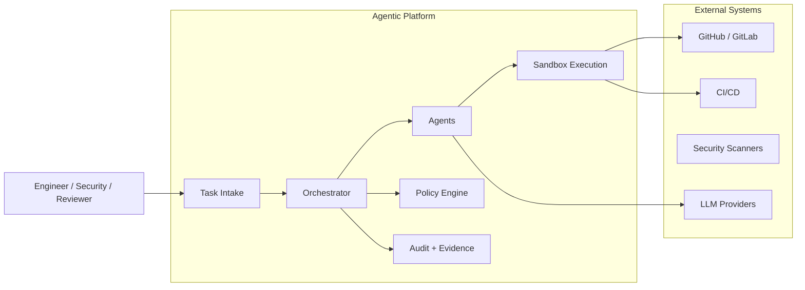

# 🚀 Agentic Software Engineering Platform

> **Ship code faster—with safety, validation, and full auditability built in.**

---

## 🧠 What is this?

The **Agentic Software Engineering Platform** is a control and execution layer that sits between developer workflows and repository infrastructure.

It accepts high-level engineering tasks and autonomously:

* implements code changes
* validates behavior (builds, tests, checks)
* remediates vulnerabilities
* produces reviewable pull requests
* enforces policy and approval workflows
* generates audit evidence for every action

---

## ⚡ Why this exists

AI coding tools like Cursor help developers write code faster—but they don’t guarantee:

* correctness
* security
* compliance
* auditability

This platform focuses on a different problem:

> **Turning AI-generated or automated changes into production-ready, trusted outputs.**

---

## 🎯 Core Principles

* **Execution > suggestion**
* **Safety by default** (sandboxed, policy-controlled)
* **Human-in-the-loop** (approval workflows)
* **Auditability first-class** (every action is traceable)
* **Composable agents** (extensible workflows)

---

## 🏗️ System Overview



---

## 🧩 Key Features

### 🤖 Agentic Workflows

* Multi-step task execution (plan → implement → validate → PR)
* Specialized agents:

  * code changes
  * test generation
  * security remediation
  * PR summarization

---

### 🛡️ Secure Sandbox Execution

* Ephemeral isolated environments
* Controlled network + secrets access
* Reproducible builds and tests

---

### 📜 Policy & Governance

* Role-based access control (RBAC)
* Approval workflows
* Repo/file-level restrictions
* Risk-aware execution

---

### 🔍 Audit & Evidence

* Immutable execution logs
* Full trace of:

  * inputs
  * decisions
  * outputs
* Compliance-ready artifacts

---

### 🔌 Integrations

* GitHub / GitLab
* CI/CD systems
* Jira / ticketing
* Slack / Teams
* Security scanners
* LLM providers

---

## 🚀 Example Workflow

**“Fix vulnerability in dependency”**

1. Task triggered (GitHub alert / Jira / CLI)
2. Platform plans remediation
3. Agent generates patch
4. Sandbox runs:

   * install
   * build
   * tests
   * security checks
5. Results validated
6. Pull request created with:

   * diff
   * explanation
   * test results
7. Reviewer approves
8. Audit trail stored

---

## 📦 Getting Started (MVP)

### Prerequisites

* GitHub or GitLab repo
* Container runtime (Docker / Kubernetes)
* Access to an LLM provider
* Object storage for artifacts

---

### Run locally (conceptual)

```bash
# Clone repo
git clone https://github.com/your-org/agentic-platform
cd agentic-platform

# Start services
docker-compose up

# Trigger a task
curl -X POST http://localhost:8080/tasks \
  -d '{
    "type": "vulnerability_fix",
    "repo": "your/repo",
    "issue_id": "123"
  }'
```

---

## 🧱 Architecture (MVP)

* Task Intake API
* Orchestrator (single workflow)
* Patch generation (LLM-assisted)
* Sandbox runner (ephemeral containers)
* Git adapter (PR creation)
* Artifact storage + audit logs

---

## 🛣️ Roadmap

### MVP

* Vulnerability → PR automation
* Basic sandbox execution
* Manual approval flow

### v1

* Multi-agent orchestration
* Policy engine (RBAC + rules)
* Broader workflows (bugs, tests, refactors)

### Scale

* Agent marketplace
* Autonomous maintenance
* Enterprise compliance features

---

## 🧭 Positioning

This platform is **not an IDE**.

| Tool          | Role                                                    |
| ------------- | ------------------------------------------------------- |
| Cursor        | Helps developers write code                             |
| This platform | Ensures code changes are safe, validated, and shippable |

---

## 🔐 Security Model

* Zero-trust execution (per-task isolation)
* Least-privilege credentials
* Deny-by-default networking
* Immutable audit trail

---

## 🤝 Contributing

We welcome contributions in:

* agent development
* integrations
* sandbox improvements
* policy frameworks

---

## 📄 License

MIT (or your preferred license)

---

## 🧠 Vision

> Software development becomes **intent-driven**,
> where engineers specify *what* needs to change—and systems safely execute *how*.

---

## ⭐ Final Thought

> This is not about writing code faster.
> It’s about **shipping code safely at scale.**
